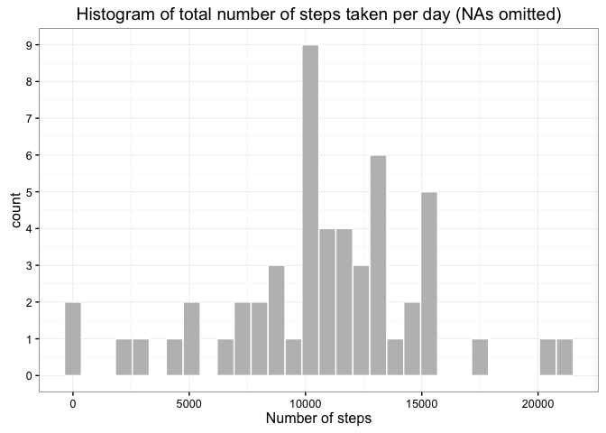
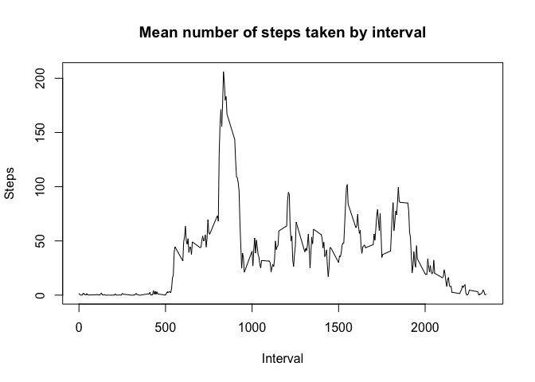
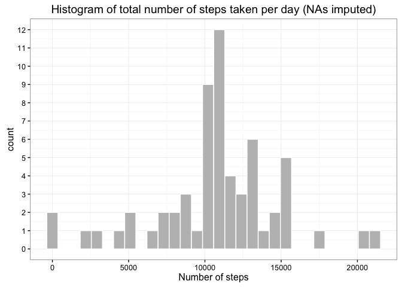
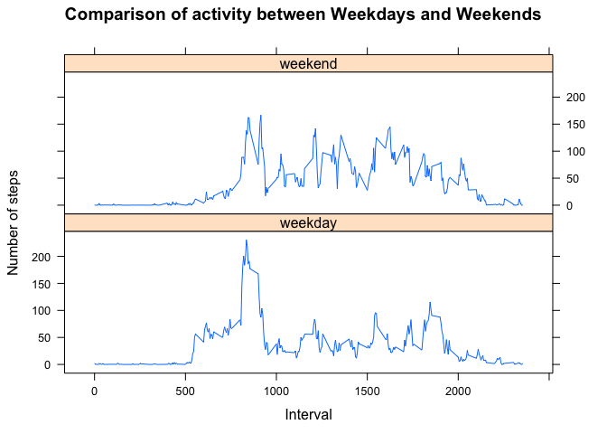

# Reproducible Research: Peer Assessment 1

## Loading and preprocessing the data


```r
library(ggplot2)
library(lattice)
library(dplyr)
```

**Read the data from the csv file contained in 'activity.zip' located in the local folder**  


```r
data <- read.csv(unzip("activity.zip","activity.csv"))
```

## What is mean total number of steps taken per day?

**Calculate total number of steps taken per day**  


```r
grpbydate <- group_by(na.omit(data), as.Date(date))
stepsbydate <- summarize(grpbydate, ts = sum(steps))
```

#### Histogram of steps taken per day


```r
g<-ggplot(data=stepsbydate, aes(stepsbydate$ts)) 
        g+ geom_histogram(bins = 30, col="white",fill="grey") + theme_bw() +
        labs(title = "Histogram of total number of steps taken per day (NAs omitted)") +
        labs(x="Number of steps") + scale_y_continuous(breaks = seq(0,10,1))
```

<!-- -->

**Calculate mean and median steps taken per day:**  


```r
mean(stepsbydate$ts)
```

[1] 10766.19

```r
median(stepsbydate$ts)
```

[1] 10765


## What is the average daily activity pattern?

**Calculate mean number of steps taken per 5-minute interval**  


```r
grpbyint <- group_by(na.omit(data), interval)
stepsbyint <- summarize(grpbyint, ms=mean(steps))
```

**Time series plot of mean number of steps taken per 5-minute interval**  


```r
plot(stepsbyint$interval, stepsbyint$ms, type = "l",
     xlab = "Interval", ylab = "Steps", main="Mean number of steps taken by interval")
```

<!-- -->

**Which time inteval has the most number of steps?**  

```r
stepsbyint$interval[which(stepsbyint$ms == max(stepsbyint$ms))]
```

[1] 835


## Imputing missing values
**How many missing values are there?**  


```r
sum(is.na(data$steps))
```

[1] 2304

**Impute missing step values by replacing NAs with the mean number of steps for that interval interval, then create the corresponding new dataset**  


```r
data1<- data %>% filter(!is.na(data$steps))
data2<- data %>% filter(is.na(data$steps))
data2 <- merge(data2, stepsbyint, by = "interval")
data2 <- data2 %>% mutate(steps=ms) %>% select(interval, steps, date)
fdata <- rbind(data1, data2)

grpbydate2 <- group_by(fdata,as.Date(date))
stepsbydate2 <- summarize(grpbydate2, ts = sum(steps))
```


```r
g<-ggplot(data=stepsbydate2, aes(stepsbydate2$ts)) 
g+ geom_histogram(bins = 30, col="white",fill="grey") + theme_bw() +
        labs(title = "Histogram of total number of steps taken per day (NAs imputed)") +
        labs(x="Number of steps") +
        scale_y_continuous(breaks = seq(0,15,1))
```

<!-- -->


## Are there differences in activity patterns between weekdays and weekends?
**Add day factor (weekend or weekday)**    

```r
wdata<-fdata %>% 
        mutate(daytype = weekdays(as.Date(date))) %>% 
        mutate(daytype = ifelse(daytype %in% c("Saturday","Sunday"),"weekend","weekday")) %>% 
        mutate(daytype = as.factor(daytype))


grpbydaytype <- group_by(wdata,interval,daytype)
stepsbydaytype <- summarize(grpbydaytype, ms = mean(steps))
```

**Weekday and weekend activity plots showing mean number of steps taken within 5-minute intervals (averaged accross all weekday days or weekend days)**  


```r
xyplot(ms~interval | daytype, data = stepsbydaytype, type="l", 
        layout = c(1,2), main = "Comparison of activity between Weekdays and Weekends",
        xlab = "Interval", ylab="Number of steps")
```

<!-- -->

